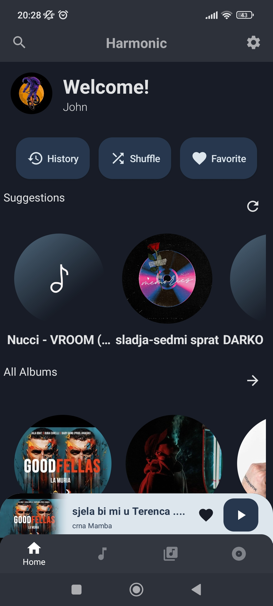
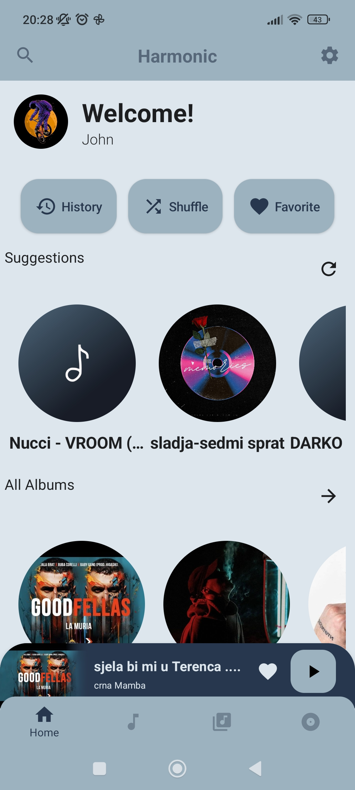
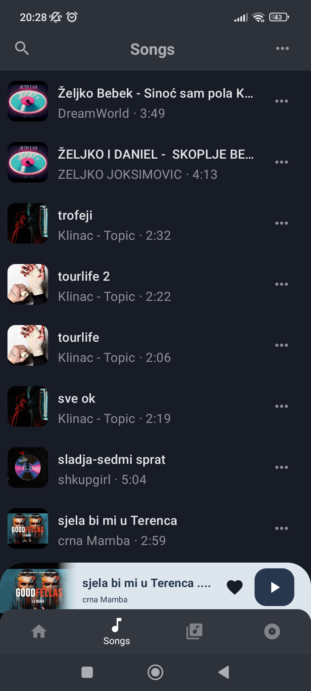
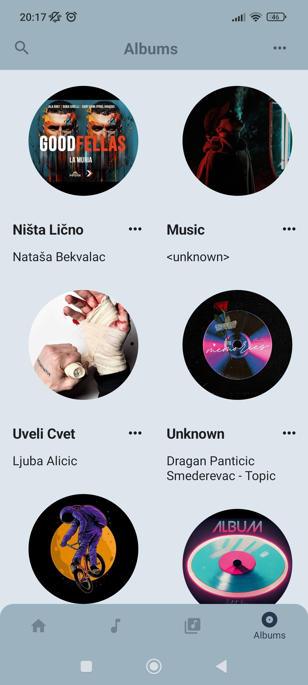
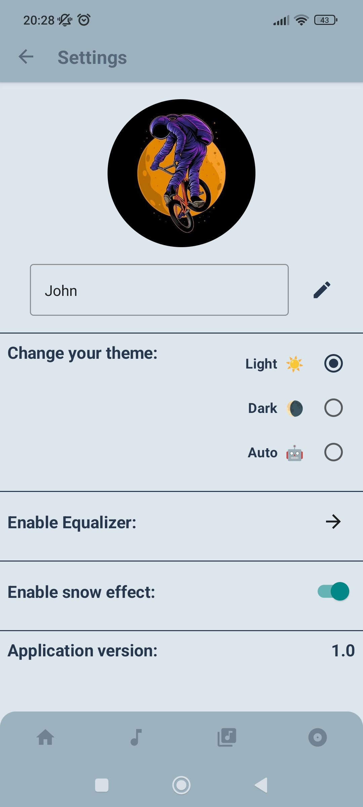
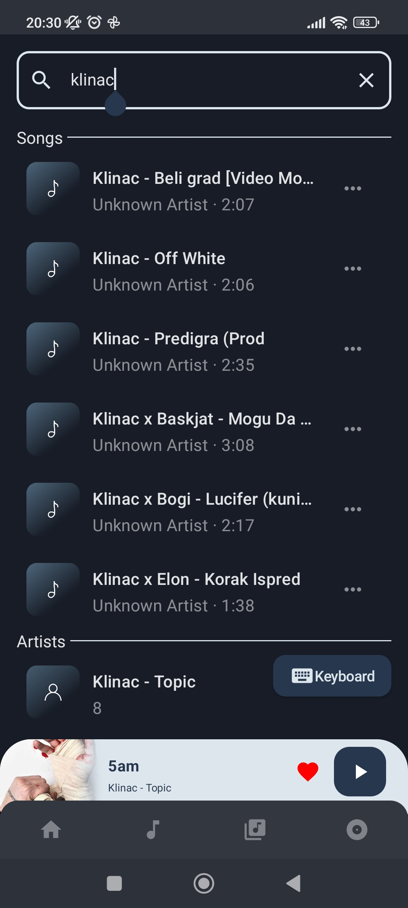
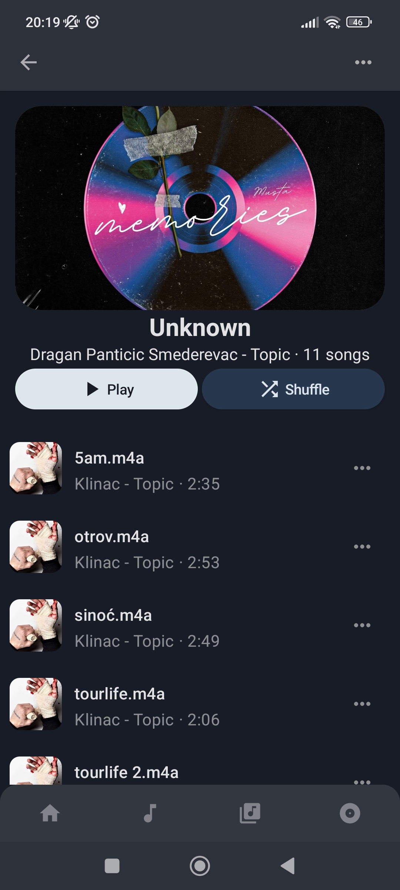
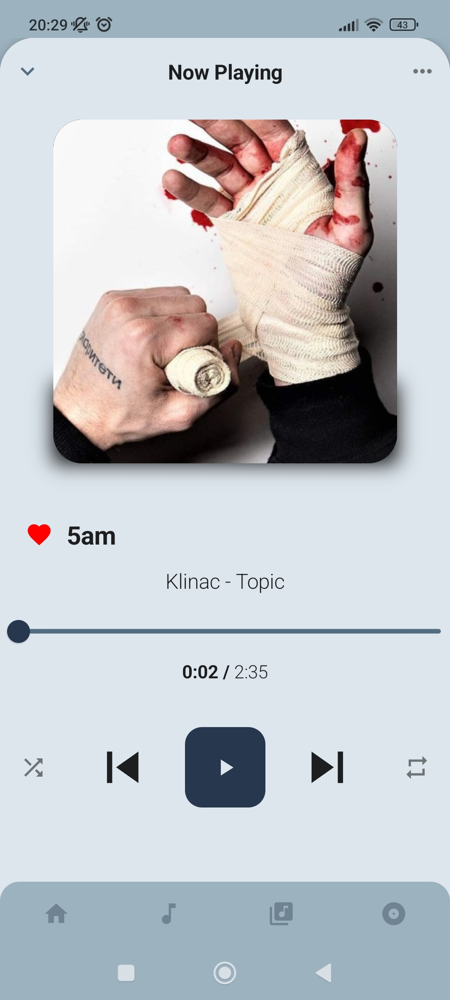
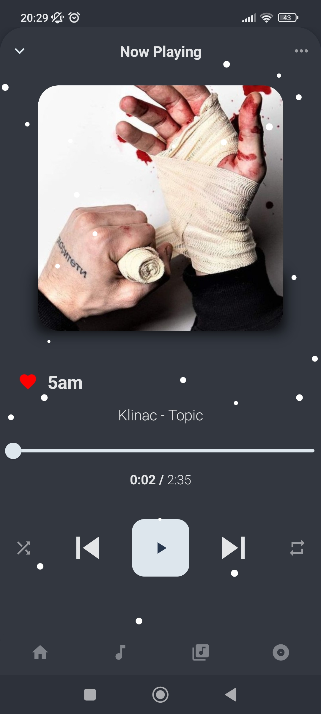

  <a href="https://harmonic.app">
    
    <h1 align="center">Harmonic Music Player 🎶</h1>
  </a>

  
  

## 📱 Screenshots
### App Themes
|  |  | 
|:---:|:---:|
|Dark theme| White theme|

### Navigation screens
| | | | | | |
|:---:|:---:|:---:|:---:|:---:|:---:|
| Home | Songs | Albums | Settings | Search | Album details |

### Player screens
| | | |
|:---:|:---:|:---:|
| White theme | Dark theme | With snow effect |

## 🧭 Navigation never been made easier 
Self-explanatory interface without overloaded menus.

## 🎨 Colorful
You can choose between two different main themes: White and Dark.

## 🏠 Home
Where you can view your recently played and
favorite songs.There is also a song recommendation.

## 📦 Included Features
-  Base 2 themes (White,Dark)
-  Headset/Bluetooth support
-  Lock screen playback controls
-  User profile
-  Browse and play your music by songs, albums, artists, playlists
-  History and Favorite songs
-  Snow effect on player screen
-  Built in equalizer
-  Recommendation for songs
-  Customizing songs,albums,playlists
-  Sharing songs
-  Player notification with audio controls
-  Splash screen
-  Local storage for songs,albums,playlists,artists

## 👨‍💻 Used technologies
-  Kotlin programming language
-  Jetpack Compose
-  Kotlin Flow
-  Kotlin coroutines
-  Room library
-  Dagger Hilt(dependency injection)
-  Glide(image loading library)
-  Clean architecture
-  MVVM design pattern
-  Use cases

>Please note: Harmonic Music Player is a local music player app. It
>doesn't support music downloading or online music streaming.
